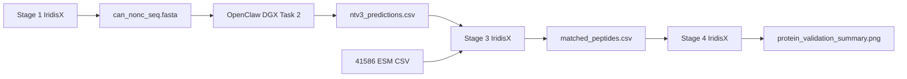

# Deutsch NTv3 Validation Pipeline

A modular Python pipeline for validating **NTv3-predicted microproteins** against the Deutsch/Kok et al. 2024 Nature supplementary table.

**Project path:** `/home/cle1g21/RPC/deutsch_ntv3_pipeline/`  
**Data path:** `/home/cle1g21/RPC/deutsch_kok_et_al_2024/`

RDS, GTF, FASTA, and supplementary CSV inputs under `deutsch_kok_et_al_2024/` are gitignored (large / licensed data). Keep the pipeline code here; place local copies of Deutsch/Kok files at the paths in `config.py` after cloning.

---

## What this project does (in plain language)

| Stage | Where it runs | What happens |
|-------|----------------|--------------|
| **1** | IridisX | Converts `can_nonc_seq.RDS` → `can_nonc_seq.fasta` |
| **2** | DGX (`openclaw-research` sandbox) | OpenClaw Agent runs NTv3 GPU inference — see [`openclaw_dgx_blueprint.md`](openclaw_dgx_blueprint.md) |
| **3** | IridisX | Matches DGX predictions to the Nature CSV by genomic coordinates |
| **4** | IridisX | Draws a publication-style bar chart comparing prediction vs. overlap counts |

Stages **1, 3, and 4** are Python scripts you run on IridisX.  
Stage **2** is intentionally **not** automated over SSH anymore; the OpenClaw Agent on DGX runs it directly inside the `openclaw-research` sandbox.

---

## Project layout

```
deutsch_ntv3_pipeline/
├── config.py               # All file paths and constants
├── main.py                 # Command-line entry point
├── requirements.txt        # pip dependencies
├── README.md               # This file
├── openclaw_dgx_blueprint.md # Copy-paste prompt for OpenClaw on DGX (Task 2)
└── src/
    ├── __init__.py
    ├── stage1_converter.py # RDS → FASTA
    ├── stage3_matcher.py     # Coordinate matching
    └── stage4_plotter.py     # Seaborn bar chart
```

**Outputs** (under `deutsch_kok_et_al_2024/output/`):

| File | Created by |
|------|------------|
| `../can_nonc_seq.fasta` | Stage 1 |
| `ntv3_predictions.csv` | Stage 2 (OpenClaw on DGX) — copy here manually |
| `matched_peptides.csv` | Stage 3 |
| `match_summary.json` | Stage 3 |
| `protein_validation_summary.png` | Stage 4 |

---

## Setup (IridisX)

```bash
cd /home/cle1g21/RPC/deutsch_ntv3_pipeline
pip install -r requirements.txt

# Recommended for Stage 1 RDS conversion:
module load R/4.5.1-mkl
```

### Docker / Apptainer (optional)

```dockerfile
# Example Dockerfile snippet
FROM python:3.11-slim
WORKDIR /pipeline
COPY requirements.txt .
RUN pip install -r requirements.txt
COPY . .
CMD ["python", "main.py", "--stage", "all"]
```

Mount data: `-v /home/cle1g21/RPC:/home/cle1g21/RPC`

---

## How to run

### Stage 1 — Convert RDS to FASTA

```bash
python main.py --stage 1
```

### Stage 2 — NTv3 on DGX (OpenClaw)

1. Ensure `can_nonc_seq.fasta` exists on IridisX (Stage 1).
2. Connect to the DGX sandbox: `nemohermes openclaw-research connect` (project root is already `/sandbox/Projects/deltaTE`).
3. Copy FASTA into the sandbox at `/sandbox/Projects/deltaTE/data/can_nonc_seq.fasta` if not already present.
4. Open [`openclaw_dgx_blueprint.md`](openclaw_dgx_blueprint.md) and paste the master prompt into the **OpenClaw Agent** inside `openclaw-research`.
5. After inference, copy `ntv3_predictions.csv` to:
   `/home/cle1g21/RPC/deutsch_kok_et_al_2024/output/`

### Stages 3 and 4 — Match and plot on IridisX

```bash
python main.py --stage 3
python main.py --stage 4

# Or both:
python main.py --stage all
```

### CLI options

| Flag | Meaning |
|------|---------|
| `--stage 1` | RDS → FASTA only |
| `--stage 3` | Coordinate matching only |
| `--stage 4` | Bar chart only |
| `--stage all` | Run 1, then 3, then 4 (skips 2) |
| `--ntv3-output PATH` | Use a specific prediction CSV for Stage 3 |
| `-v` | Verbose debug logging |

---

## Data column mapping (Stage 3)

The Nature CSV uses `chrm`, `starts`, `ends`. The matcher normalizes to `chr`, `start`, `end`:

| Canonical | Accepted names |
|-----------|----------------|
| chr | chr, chrm, chrom, chromosome |
| start | start, starts, start_pos |
| end | end, ends, end_pos |

Matches require **identical** coordinate strings (including semicolon-separated multi-exon values).

---

## Function reference

### `config.py`

#### `PipelineConfig` (dataclass)

Holds every path the pipeline needs. Built by `PipelineConfig.from_env()`.

| Field | Default | Purpose |
|-------|---------|---------|
| `data_root` | `.../deutsch_kok_et_al_2024` | Input data folder |
| `rds_path` | `.../can_nonc_seq.RDS` | Stage 1 input |
| `fasta_path` | `.../can_nonc_seq.fasta` | Stage 1 output |
| `validation_csv_path` | `.../41586_2026_10459_MOESM4_ESM.csv` | Nature baseline |
| `output_dir` | `.../output/` | DGX downloads + Stage 3/4 outputs |
| `matched_csv_path` | `.../matched_peptides.csv` | Stage 3 output |
| `match_summary_path` | `.../match_summary.json` | Counts for Stage 4 |
| `summary_png_path` | `.../protein_validation_summary.png` | Stage 4 figure |

#### `PipelineConfig.from_env() -> PipelineConfig`

Reads optional environment variables `PIPELINE_DATA_ROOT`, `PIPELINE_OUTPUT_DIR`, `NTV3_OUTPUT_GLOB`.

---

### `main.py`

#### `parse_args(argv=None) -> argparse.Namespace`

Reads `--stage`, `--ntv3-output`, and `-v` from the command line.

#### `run_pipeline(args, config) -> int`

Runs the selected stages in order. Returns `0` on success.

#### `main(argv=None) -> int`

Configures logging, loads config, calls `run_pipeline`. Exit code `1` on any exception.

---

### `src/stage1_converter.py`

#### `probe_rds_class(rds_path) -> str`

Inspects the RDS file (via Rscript or pyreadr) and returns class/column information. Use this to debug unexpected RDS shapes.

#### `convert_rds_to_fasta(rds_path, fasta_path) -> int`

Converts sequences to FASTA. Tries Rscript first, then pyreadr + Biopython. Returns the number of records written.

#### `validate_fasta(fasta_path) -> None`

Checks that FASTA is non-empty and sequences have no embedded whitespace.

#### `run_stage1(config) -> int`

High-level Stage 1: probe, convert, log. Returns record count.

#### `RdsConversionError`

Raised when conversion or validation fails.

---

### `src/stage3_matcher.py`

#### `load_ntv3_output(path) -> pd.DataFrame`

Loads the DGX prediction CSV/TSV and normalizes coordinate columns.

#### `load_validation_csv(path) -> pd.DataFrame`

Loads the Nature supplementary CSV with normalized coordinates.

#### `normalize_coordinates(df, source_label) -> pd.DataFrame`

Renames `chrm`/`starts`/`ends` (and aliases) to `chr`/`start`/`end` as strings.

#### `match_peptides(ntv3_df, validation_df) -> pd.DataFrame`

Inner-join on `(chr, start, end)`; keeps **all columns** from both tables.

#### `count_coordinate_overlap(ntv3_df, validation_df) -> int`

Counts unique coordinate triplets found in both datasets (used for the bar chart).

#### `run_stage3(config, ntv3_path=None) -> dict`

Writes `matched_peptides.csv` and `match_summary.json`. Returns summary counts.

#### `MatcherError`

Raised when required coordinate columns are missing.

---

### `src/stage4_plotter.py`

#### `build_summary_counts(ntv3_total, matched_total) -> pd.DataFrame`

Builds two rows for plotting: Bar A = NTv3 total, Bar B = verified overlap.

#### `plot_validation_bars(counts, output_path, dpi=300) -> Path`

Creates a **whitegrid** Seaborn bar chart with **45°** rotated x-labels (`ha='right'`) at **300 DPI**.

#### `run_stage4(config, summary=None) -> Path`

Reads `match_summary.json` (or uses provided summary) and saves the PNG.

---

## End-to-end workflow



---

## Troubleshooting

| Problem | Solution |
|---------|----------|
| Stage 1: `Rscript not found` | `module load R/4.5.1-mkl` |
| Stage 1: pyreadr fails | Install `pyreadr` or use R module |
| Stage 3: no NTv3 file | Complete Task 2 on DGX; copy CSV to `output/` |
| Stage 3: missing columns | Ensure NTv3 output has chr/start/end (or aliases) |
| Stage 4: no summary JSON | Run Stage 3 first |

---

## Why SSH automation was removed

Remote `nemohermes exec` over non-interactive SSH was fragile (gRPC NotFound, TTY errors, Ollama cold-start timeouts). Task 2 now runs **natively inside the OpenClaw Agent** in the `openclaw-research` sandbox, which has direct GPU and OpenClaw/Ollama access.
