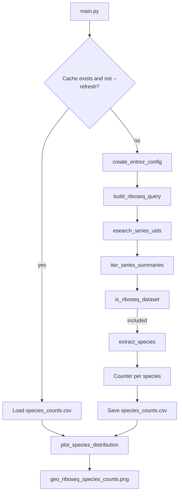

# GEO Ribo-seq Visualizer

A production-ready Python tool that queries **NCBI GEO** via **Entrez utilities**
(Biopython `Bio.Entrez`), discovers **Ribo-seq / ribosome profiling** datasets
(including studies misclassified under generic library strategies), aggregates
**dataset counts per species**, and generates a **publication-ready vertical bar
plot** with a **log₁₀-scaled** y-axis.

Project path: `/home/cle1g21/RPC/geo_riboseq_visualizer/`

---

## Table of contents

1. [Purpose](#purpose)
2. [Environment setup](#environment-setup)
3. [Repository structure](#repository-structure)
4. [How the pipeline works](#how-the-pipeline-works)
5. [Entrez search terms (multi-tier)](#entrez-search-terms-multi-tier)
6. [Ribo-seq dataset validation](#ribo-seq-dataset-validation)
7. [How to run](#how-to-run)
8. [Plot specification](#plot-specification)
9. [Function reference — `main.py`](#function-reference--mainpy)
10. [Function reference — `src/geo_client.py`](#function-reference--srcgeo_clientpy)
11. [Function reference — `src/visualizer.py`](#function-reference--srcvisualizerpy)
12. [NCBI usage notes](#ncbi-usage-notes)
13. [Limitations](#limitations)

---

## Purpose

Ribo-seq (ribosome profiling) measures ribosome-protected mRNA fragments (RPFs) to
infer translation. GEO hosts thousands of Series (GSE), but many Ribo-seq studies are
labeled with ambiguous library strategies such as **`Other`** or **`RNA-Seq`** even
when their titles and experimental descriptions clearly describe ribosome profiling.

This tool:

1. Searches GEO DataSets (`db=gds`) for candidate **GEO Series (GSE)** records.
2. **Validates** each candidate using deep metadata rules (not just library strategy tags).
3. Aggregates validated counts **per species**.
4. Plots the **top 30** species plus an aggregated **Other** species bar.

---

## Environment setup

```bash
cd /home/cle1g21/RPC/geo_riboseq_visualizer
conda env create -f environment.yml
conda activate geo-riboseq-visualizer
```

`output/` (cached GEO tables and figures) is gitignored. Re-run `main.py` after cloning to regenerate plots.

| Package | Role |
|---------|------|
| Python ≥ 3.10 | Runtime |
| biopython | `Bio.Entrez` for NCBI GEO queries |
| pandas | Species count table |
| seaborn / matplotlib | Publication figure |

---

## Repository structure

```
geo_riboseq_visualizer/
├── environment.yml
├── README.md
├── main.py                 # CLI entry point
└── src/
    ├── __init__.py
    ├── geo_client.py       # Entrez search + Ribo-seq validation + aggregation
    └── visualizer.py       # A4-optimized vertical log-scale bar plot
```

**Generated outputs** (after running `main.py`):

```
output/
├── species_counts.csv              # full species × count table
└── geo_riboseq_species_counts.png    # publication figure (top 30 + Other)
```

---

## How the pipeline works



**Important:** Every Entrez hit is validated before it contributes to a species count.
Search breadth and validation strictness are separate steps.

---

## Entrez search terms (multi-tier)

The default query is built by `build_riboseq_query()` in `src/geo_client.py`.
It combines **two tiers** with a logical **OR**, then restricts to GEO Series:

```
( Tier1 OR Tier2 ) AND gse[Entry Type]
```

### Tier 1 — explicit Ribo-seq nomenclature

Searches synonym variations and molecular indicators in **title, abstract, and all
indexed GEO fields** (including Library Strategy):

```
"ribosome profiling"[All Fields]
OR "Ribo-seq"[All Fields]
OR "Ribo-seq"[Library Strategy]
OR "Ribo seq"[All Fields]
OR "ribosomal footprinting"[All Fields]
OR "ribosome footprints"[All Fields]
OR "ARTseq"[All Fields]
OR "translation profiling"[All Fields]
```

**Goal:** Find studies openly labeled as Ribo-seq or ribosome profiling.

### Tier 2 — technical indicators under ambiguous library strategies

Searches classic Ribo-seq biochemistry terms **only when** the native library strategy
is generically tagged:

**Indicators (All Fields):**

| Category | Search terms |
|----------|----------------|
| Translation elongation inhibitor | `cycloheximide` |
| Translation initiation inhibitors | `harringtonine`, `lactimidomycin` |
| Footprinting nucleases | `RNase I`, `micrococcal nuclease`, `MNase` |
| Protected fragments | `ribosome-protected fragments`, `RPFs`, `RPF` |

**Ambiguous library strategies:**

```
"Other"[Library Strategy]
OR "RNA-Seq"[Library Strategy]
OR "RNA-seq"[Library Strategy]
```

**Goal:** Recover Ribo-seq datasets **misclassified** as `Other` or `RNA-Seq` that would
be missed by keyword-only Tier 1 searches.

### Full default query (single line)

```
(
  ("ribosome profiling"[All Fields] OR "Ribo-seq"[All Fields] OR "Ribo-seq"[Library Strategy]
   OR "Ribo seq"[All Fields] OR "ribosomal footprinting"[All Fields]
   OR "ribosome footprints"[All Fields] OR "ARTseq"[All Fields]
   OR "translation profiling"[All Fields])
  OR
  (
    (cycloheximide[All Fields] OR harringtonine[All Fields] OR lactimidomycin[All Fields]
     OR "RNase I"[All Fields] OR "micrococcal nuclease"[All Fields] OR MNase[All Fields]
     OR "ribosome-protected fragments"[All Fields] OR RPFs[All Fields] OR RPF[All Fields])
    AND
    ("Other"[Library Strategy] OR "RNA-Seq"[Library Strategy] OR "RNA-seq"[Library Strategy])
  )
) AND gse[Entry Type]
```

Override with `python main.py --query 'YOUR_TERM' --refresh` if needed.

---

## Ribo-seq dataset validation

After Entrez returns candidate GSE records, `is_riboseq_dataset()` decides whether each
Series counts toward species totals.

### Metadata fields scanned

`extract_metadata_text()` concatenates text from:

- **Title**
- **Summary**
- **Overall Design**
- Related description keys (`description`, `gds_title`, etc.)

`extract_library_strategy()` reads the native **Library Strategy** / dataset type field.

### Validation decision tree

```
1. Library strategy explicitly indicates Ribo-seq?
   → INCLUDE (reason: explicit_library_strategy)

2. Title/Summary/Design contains explicit Ribo-seq terms?
   (ribosome profiling, Ribo-seq, ARTseq, translation profiling, …)
   → INCLUDE (reason: explicit_metadata_terms)

3. Title/Summary/Design contains technical indicators?
   (cycloheximide, harringtonine, RNase I, MNase, RPFs, …)
   → INCLUDE (reason: technical_indicators or rescued_by_technical_indicators)

4. Library strategy is Other/RNA-Seq but NO terms or indicators?
   → EXCLUDE (reason: ambiguous_strategy_no_indicators)

5. Otherwise no Ribo-seq evidence?
   → EXCLUDE (reason: no_riboseq_evidence)
```

### Explicit Ribo-seq terms (regex, case-insensitive)

Matched in metadata text by `has_explicit_riboseq_terms()`:

- ribosome profiling
- Ribo-seq / Ribo seq
- ribosomal footprinting
- ribosome footprints
- ARTseq
- translation profiling

### Technical indicators (regex, case-insensitive)

Matched in metadata text by `has_technical_riboseq_indicators()`:

| Indicator | Biological role in Ribo-seq |
|-----------|---------------------------|
| cycloheximide | Stalls elongating ribosomes |
| harringtonine | Blocks initiation (initiation profiling) |
| lactimidomycin | Initiation inhibitor |
| RNase I | Digests unprotected mRNA |
| micrococcal nuclease / MNase | Alternative nuclease for footprinting |
| ribosome-protected fragments / RPF / RPFs | Defining molecular readout |

### Ambiguous library strategies (not auto-excluded)

These labels trigger **deeper** text scanning rather than automatic rejection:

- `Other`
- `RNA-Seq` / `RNA-seq`
- `RNA sequencing`
- `Unknown` / empty

A record tagged `Other` with cycloheximide and RPF language in its Overall Design is
**rescued** (`rescued_by_technical_indicators`).

### What gets counted

- **Unit:** one GEO **Series (GSE)** per Entrez hit (after validation).
- **Species:** from `taxon` / `organism` fields; missing values → `Unknown`.
- **Output columns:** `species`, `dataset_count`.

### Example validation statistics (reference run)

| Metric | Count |
|--------|------:|
| Entrez hits (pre-validation) | 2,641 |
| Included (validated Ribo-seq) | 2,410 |
| Excluded | 231 |
| Rescued via technical indicators | 59 |
| Distinct species | 203 |

Run with `-v` to log per-record exclusion reasons at DEBUG level.

---

## How to run

### Default (use cache)

```bash
cd /home/cle1g21/RPC/geo_riboseq_visualizer
python main.py
```

### Re-query NCBI and regenerate figure

```bash
python main.py --refresh
```

### Verbose validation logging

```bash
python main.py --refresh -v
```

### CLI flags

| Flag | Default | Description |
|------|---------|-------------|
| `--output` | `output/geo_riboseq_species_counts.png` | Figure path |
| `--cache` | `output/species_counts.csv` | Full species count table |
| `--refresh` | off | Force new Entrez query |
| `--top` | `30` | Top species plotted after **Other** |
| `--batch-size` | `200` | Records per `esummary` request |
| `--sleep-seconds` | `0.34` | Delay between Entrez calls |
| `--api-key` | none | Optional NCBI API key |
| `--query` | multi-tier default | Override Entrez search term |
| `-v` / `--verbose` | off | Debug logging |

---

## Plot specification

Implemented in `src/visualizer.py`:

| Feature | Setting |
|---------|---------|
| Chart type | Vertical bar plot (`sns.barplot`) |
| **Other** bar | Leftmost — sum of all species outside top N |
| Species order | Top N sorted ascending by count (low → high) |
| X-axis | Species names, **45°** rotation, `ha='right'` |
| Y-axis | `dataset_count`, **log₁₀** scale |
| Value labels | Horizontal (`rotation=0`), above bars |
| Label overlap | Staggered vertical offset (alternating bars) |
| Font sizes | Title 18, axis labels 14, ticks 11, values 10 |
| Resolution | 300 DPI default |
| Layout | `tight_layout()`, extra y-axis headroom |

---

## Function reference — `main.py`

### `parse_args(argv=None) -> argparse.Namespace`

Defines the command-line interface. Parses paths, cache/refresh behavior, Entrez
tuning parameters (`--batch-size`, `--sleep-seconds`, `--api-key`), optional custom
`--query`, and `--verbose`.

**Returns:** Namespace used by the rest of the pipeline.

---

### `load_or_fetch_counts(args) -> pd.DataFrame`

Loads species counts from `args.cache` when the file exists and `--refresh` is not set.

Otherwise:

1. Calls `create_entrez_config(api_key=args.api_key)`
2. Builds Entrez term: `args.query` or `build_riboseq_query()`
3. Calls `fetch_species_counts()` with batching and sleep settings
4. Writes CSV cache to `args.cache`

**Returns:** DataFrame with columns `species`, `dataset_count`.

---

### `main(argv=None) -> int`

Orchestrates the full pipeline:

1. Configure logging (INFO or DEBUG)
2. `load_or_fetch_counts()`
3. `plot_species_distribution()`
4. Log output path

**Returns:** `0` on success.

---

## Function reference — `src/geo_client.py`

### Classes

#### `GeoEntrezError`

Exception raised when Entrez requests fail unrecoverably (malformed response, repeated errors).

#### `EntrezSearchHandle` (dataclass)

Stores Entrez History server parameters after `esearch`:

- `webenv` — WebEnv token
- `query_key` — QueryKey
- `total` — number of matching records

#### `RiboseqValidationStats` (dataclass)

Mutable counters logged at the end of `fetch_species_counts()`:

- `total_summaries`
- `included`
- `excluded`
- `rescued_by_indicators`
- `explicit_strategy_or_terms`

---

### `create_entrez_config(email="cle1g21@soton.ac.uk", api_key=None) -> None`

Configures Biopython Entrez globals:

- `Entrez.email` (required by NCBI)
- `Entrez.tool = "geo-riboseq-visualizer"`
- `Entrez.api_key` (optional, for higher rate limits)

---

### `build_riboseq_query() -> str`

Builds the **multi-tier** Entrez query string described in
[Entrez search terms](#entrez-search-terms-multi-tier).

**Returns:** Complete query with `gse[Entry Type]` constraint.

---

### `_coerce_summary_dict(summary) -> dict`

Internal helper. Converts Biopython Entrez summary objects (dict-like or `ListElement`)
into a plain Python `dict` for consistent field access.

---

### `_field_value(summary, keys) -> str`

Internal helper. Returns the first non-empty string found among a tuple of candidate
metadata keys (handles list-valued fields).

---

### `extract_metadata_text(summary) -> str`

Concatenates all text from title, summary, overall design, and related keys into one
string for regex-based validation.

**Used by:** `is_riboseq_dataset()`, `has_explicit_riboseq_terms()`, `has_technical_riboseq_indicators()`.

---

### `extract_library_strategy(summary) -> str`

Reads the GEO **Library Strategy** (or equivalent `gdsType` / `GTYP` fields).

**Returns:** Strategy label string, or `""` if missing.

---

### `has_technical_riboseq_indicators(text) -> bool`

Returns `True` if `text` matches any technical Ribo-seq indicator regex
(cycloheximide, harringtonine, lactimidomycin, RNase I, MNase, RPFs, etc.).

---

### `has_explicit_riboseq_terms(text) -> bool`

Returns `True` if `text` matches explicit Ribo-seq nomenclature regex
(ribosome profiling, Ribo-seq, ARTseq, translation profiling, etc.).

---

### `strategy_indicates_riboseq(strategy) -> bool`

Returns `True` when the library strategy field is a **non-ambiguous** Ribo-seq label
(contains ribo, footprint, profiling, ARTseq, RPF, etc.).

Returns `False` for ambiguous strategies (`Other`, `RNA-Seq`, empty).

---

### `is_riboseq_dataset(summary) -> tuple[bool, str]`

**Core validation function.** Implements the full decision tree in
[Ribo-seq dataset validation](#ribo-seq-dataset-validation).

**Args:** One GEO DataSets `esummary` document as a dict.

**Returns:**

- `bool` — whether to count this Series as Ribo-seq
- `str` — reason tag (e.g. `rescued_by_technical_indicators`)

---

### `esearch_series_uids(term) -> EntrezSearchHandle`

Runs `Entrez.esearch(db="gds", term=term, usehistory="y")`.

**Returns:** `EntrezSearchHandle` with total hit count and History server tokens for pagination.

**Raises:** `GeoEntrezError` on failure.

---

### `iter_series_summaries(search, batch_size=200, sleep_seconds=0.34) -> Iterator[dict]`

Paginates through `Entrez.esummary` using the History server (`WebEnv` + `QueryKey`).
Yields one coerced summary dict per GEO Series.

Sleeps `sleep_seconds` between batches for NCBI rate compliance.

---

### `extract_species(summary) -> str | None`

Extracts organism/species from standard GEO summary keys (`taxon`, `organism`, `Taxon`, etc.).

**Returns:** Species name string, or `None` if not found (caller may use `Unknown`).

---

### `fetch_species_counts(term=None, batch_size=200, sleep_seconds=0.34, unknown_label="Unknown") -> pd.DataFrame`

**Main data aggregation function.**

1. `esearch_series_uids(term or build_riboseq_query())`
2. For each summary: `is_riboseq_dataset()` → include or exclude
3. For included records: `extract_species()` → increment `Counter`
4. Log `RiboseqValidationStats`
5. Return sorted DataFrame (`species`, `dataset_count`)

---

## Function reference — `src/visualizer.py`

### `prepare_plot_data(df, top=30) -> pd.DataFrame`

Transforms the **full** species count table into plot-ready data:

1. Sort all species by `dataset_count` descending
2. Take top `top` species
3. Sum all remaining species into one row labeled **`Other`**
4. Order for plotting: **`Other` first**, then top species **ascending** by count

**Note:** Plot **Other** is “all species outside top N”, not the Entrez `Other` library strategy.

---

### `_value_label_offset_points(index) -> int`

Internal helper for staggered bar value labels:

- Even bar index (0-based): **14 pt** offset above bar
- Odd bar index: **4 pt** offset above bar

Prevents horizontal count labels from overlapping on densely packed bars.

---

### `plot_species_distribution(df, output_path, top=30, dpi=300, figsize=(13.0, 8.27)) -> Path`

Creates and saves the publication figure:

- Calls `prepare_plot_data()`
- Vertical `sns.barplot` with log₁₀ y-axis
- 45° right-aligned species labels
- Staggered horizontal integer labels above bars
- A4 typography and 300 DPI output

**Returns:** `Path` to saved figure (`.png`, `.pdf`, or `.svg` by extension).

---

## NCBI usage notes

| Setting | Value |
|---------|-------|
| `Entrez.email` | `cle1g21@soton.ac.uk` |
| `Entrez.tool` | `geo-riboseq-visualizer` |
| Default sleep | 0.34 s between `esummary` batches |
| Cache | `output/species_counts.csv` — avoid unnecessary `--refresh` |

NCBI requires a contact email for Entrez. An API key (`--api-key`) is optional but
recommended for repeated large queries.

---

## Limitations

1. **GSE-level counts** — one Series per Entrez record, not per GSM sample.
2. **Species strings** — GEO submitter/curator labels, not normalized NCBI Taxonomy.
3. **Compound organisms** — some Series list multiple species in one field.
4. **Metadata sparsity** — Series with minimal summaries may be excluded despite being Ribo-seq.
5. **Plot Other vs. library Other** — the leftmost **Other** bar aggregates rare *species*;
   it is unrelated to GEO’s `Other` library strategy tag.
6. **Search + validate** — Tier 2 broadens discovery, but validation still requires
   text evidence in Entrez summaries.

---

## License

Use and modify freely for research and teaching.
