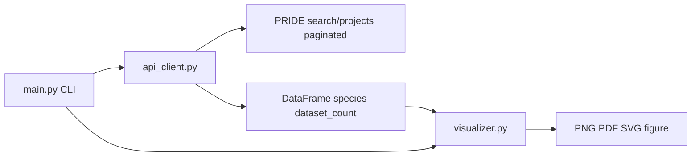

# PRIDE Species Visualizer

A production-ready Python tool that queries the [PRIDE Archive](https://www.ebi.ac.uk/pride/) REST API, aggregates proteomics **dataset counts per annotated species/organism**, and generates a **publication-ready vertical bar chart** with a **log₁₀-scaled** y-axis.

Project path: `/home/cle1g21/RPC/pride_species_visualizer/`

## Purpose

The PRIDE Archive hosts tens of thousands of mass spectrometry projects spanning thousands of organism labels. Dataset counts vary by orders of magnitude (e.g. *Homo sapiens* vs. rare species). This tool:

1. **Fetches** all project metadata via paginated `search/projects` requests.
2. **Aggregates** counts per species from each project's `organisms` field.
3. **Plots** the top 30 species plus an aggregated **Other** category as vertical bars (default).

## Setup

```bash
cd /home/cle1g21/RPC/pride_species_visualizer
conda env create -f environment.yml
conda activate pride-species-visualizer
```

If Conda is unavailable:

```bash
pip install requests pandas seaborn matplotlib
```

## Architecture



| File | Role |
|------|------|
| `main.py` | CLI: parse arguments, orchestrate fetch/cache/plot |
| `src/api_client.py` | PRIDE API pagination, aggregation, CSV cache |
| `src/visualizer.py` | Vertical log-scale Seaborn/Matplotlib figure |
| `environment.yml` | Conda dependencies |

Running the pipeline creates an `output/` directory (cache CSV and figure). This folder is generated at runtime, listed in the repository-root `.gitignore`, and is not part of the source package layout.

## The "Other" category

When plotting the default top 30 view (without `--plot-all`), `prepare_plot_data()` in `src/visualizer.py`:

1. Sorts all species by `dataset_count` descending.
2. Keeps the **top 30** species as individual bars.
3. **Sums** `dataset_count` for every remaining species (ranks 31 through *N*) into one row labeled **`Other`**.
4. Orders bars left-to-right by ascending count among the top 30, with **`Other` always first** (leftmost bar), followed by the top species in ascending count order.

Example: if there are 4,610 species, `Other` represents the combined contribution of 4,580 species not shown individually.

This aggregation is **automatic**; no CLI flag is required. Use `--plot-all` to disable it and plot every species.

## Visualization design

`plot_species_distribution()` produces a **vertical** bar chart:

| Axis | Content |
|------|---------|
| **X-axis (bottom)** | Species names, rotated 90° for legibility |
| **Y-axis (left)** | Dataset counts on a **log₁₀** scale |
| **Bar labels** | Exact integer counts printed **above** each bar |

Theme: `sns.set_theme(style="whitegrid")`, 300 DPI output, steelblue bars with dark edges.

## Function reference

### `src/api_client.py`

#### `PrideApiError`

Custom exception for unrecoverable PRIDE API failures.

#### `create_session() -> Session`

HTTP session with User-Agent `pride-species-visualizer/1.0.0` and timeouts `(10, 120)` seconds.

#### `_request_with_retry(session, url, params=None) -> Response`

GET with exponential backoff on 429/5xx; fails fast on other 4xx errors.

#### `get_total_project_count(session) -> int`

`GET /projects/count` — total PRIDE projects.

#### `get_expected_organism_count(session) -> int | None`

`GET /findAllOrganismsCount` — distinct organism sanity check (~4604).

#### `fetch_projects_page(session, page, page_size=100) -> list[dict]`

One page from `GET /search/projects`.

#### `aggregate_organism_counts(projects, *, bucket_unknown=True) -> Counter[str]`

Increments each organism label per project; empty `organisms` → `Unknown`.

#### `fetch_all_species_counts(page_size=100, *, show_progress=True, bucket_unknown=True) -> pd.DataFrame`

Paginates all projects; returns `species` and `dataset_count` columns.

#### `save_counts_cache(df, path)` / `load_counts_cache(path)`

Write/read aggregated counts as CSV.

### `src/visualizer.py`

#### `prepare_plot_data(df, top=30, *, plot_all=False) -> pd.DataFrame`

Builds the plotting table with automatic **Other** aggregation (see above).

#### `_figure_size(n_bars, figsize) -> tuple[float, float]`

Width scales with bar count (`max(11, 0.4 × n_bars)` inches); height 7 inches.

#### `plot_species_distribution(df, output_path, *, top=30, plot_all=False, figsize=None, dpi=300, label_rotation=90) -> Path`

Renders and saves the vertical log-scale figure.

### `main.py`

#### `parse_args(argv=None) -> argparse.Namespace`

Defines CLI flags.

#### `run_pipeline(args) -> int`

Load cache or fetch API → plot → print summary.

#### `main() -> None`

CLI entry point.

## Usage

```bash
cd /home/cle1g21/RPC/pride_species_visualizer
```

### Default (top 30 + Other, from cache if present)

```bash
python main.py
```

Writes `output/species_counts.csv` and `output/pride_species_counts.png`.

### Custom top *N* with Other

```bash
python main.py --top 25 --output output/top25.png
```

### Plot every species (no Other; very wide figure)

```bash
python main.py --plot-all --output output/all_species.png
```

### Force fresh API download

```bash
python main.py --refresh
```

### CLI reference

| Flag | Default | Description |
|------|---------|-------------|
| `--output` | `output/pride_species_counts.png` | Figure path |
| `--top` | `30` | Ranked species before `Other` |
| `--plot-all` | off | Plot all species (no `Other`) |
| `--page-size` | `100` | API page size |
| `--cache` | `output/species_counts.csv` | CSV cache path |
| `--refresh` | off | Re-fetch from API |
| `--no-progress` | off | Suppress pagination logs |
| `-v`, `--verbose` | off | Debug logging |

## Runtime expectations

- Full API scan: ~400 requests, **5–15 minutes**.
- Cached re-plot: a few seconds.

## Limitations

1. Multi-organism projects count once per listed organism.
2. Organism strings are not normalized to NCBI taxonomy.
3. `--plot-all` with ~4,600 species produces a very wide, dense figure.

## License

Use and modify freely for research and teaching.
